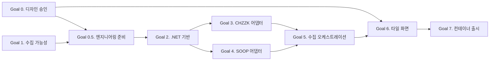

# 통합 스트리밍 레이더 실행 계획.

## 제품 목표.

CHZZK과 SOOP에서 현재 방송 중인 채널만 주기적으로 수집하고, 하나의 빠르고 보기 좋은 타일 화면에 표시한다. 방송 타일을 클릭하면 원본 플랫폼 방송 페이지로 이동한다.

## 확정 범위.

- 플랫폼은 CHZZK과 SOOP만 지원한다.
- 현재 라이브 목록만 메모리에 유지한다.
- 과거 방송, 오프라인 채널, 시청 기록, 사용자 데이터는 저장하지 않는다.
- ASP.NET Core 단일 애플리케이션과 단일 Docker 컨테이너로 운영한다.
- 화면 요청은 외부 플랫폼을 호출하지 않고 현재 메모리 스냅샷만 읽는다.
- 방송 태그를 수집하고 플랫폼, 방송인 이름, 제목, 태그로 현재 방송을 검색하고 필터링한다.

## 확정 기술 스택.

- .NET 10, ASP.NET Core, Razor Pages.
- `BackgroundService`, `IHttpClientFactory`, `System.Text.Json`.
- `ImmutableArray`와 `FrozenDictionary` 기반 불변 메모리 스냅샷, `Interlocked.Exchange` 원자 교체.
- 직접 작성한 CSS와 최소한의 브라우저 JavaScript.
- xUnit, ASP.NET Core `TestServer` 또는 로컬 HTTP 테스트 서버, Playwright for .NET.
- `dotnet test`, `dotnet format`, 경고 오류 처리, HTTP 부하 테스트.

## 확정 디자인 계약.

- 다크 모드만 지원한다.
- 디자인 토큰, 타이포그래피, 타일 구조, 반응형 규칙, 상태 화면은 [DESIGN.md](DESIGN.md)를 따른다.
- UI 구현 중 디자인 변경이 필요하면 코드보다 `DESIGN.md`를 먼저 수정한다.

## 엔지니어링 운영 계약.

- TDD, 애자일 실행, 아키텍처, 명명, 오류, 동시성, 설정, 관측성, 의존성 정책은 [ENGINEERING.md](ENGINEERING.md)를 따른다.
- 구현 전 필요한 결정과 스파이크 또는 측정 후 결정할 항목을 구분한다.
- 새 추상화, 패턴, 의존성은 현재 Task의 필요가 증명될 때만 추가한다.
- 코드는 단순하고 우아해야 한다. 기능 수보다 개념 수를 작게 유지하고 데이터 흐름이 코드에서 바로 보여야 한다.

## TDD 운영 규칙.

모든 구현 Task는 다음 순서를 지킨다.

1. 관찰 가능한 동작과 완료 조건을 먼저 정의한다.
2. 해당 동작을 검증하는 실패 테스트를 먼저 작성하고 실제 실패를 확인한다.
3. 테스트를 통과시키는 최소 구현만 작성한다.
4. 테스트가 통과하는 상태에서만 리팩터링한다.
5. 관련 단위 테스트, 통합 테스트, 정적 검사를 실행한다.
6. Goal 완료 전 전체 회귀 테스트와 Goal별 검증을 실행한다.

실제 외부 API 호출은 반복 가능한 자동 테스트가 아니므로 fixture를 확보하는 스파이크와 배포 전 스모크 테스트로 분리한다.

## Goal 로드맵.

| 순서 | Goal | 결과 | 상태 |
| --- | --- | --- | --- |
| 0 | [다크 모드 디자인 승인](plans/goal-00-design-approval.md) | `DESIGN.md` 기반 화면 디자인 계약 확정. | 완료 |
| 0.5 | [엔지니어링 시작 준비 승인](plans/goal-00-engineering-readiness.md) | TDD, 아키텍처, 명명, 운영 계약 승인. | 완료 |
| 1 | [수집 가능성 검증](plans/goal-01-api-feasibility.md) | CHZZK과 SOOP 수집 경로, fixture, 호출 정책 확정. | 완료 |
| 2 | [.NET 기반과 도메인 구축](plans/goal-02-dotnet-foundation.md) | 실행 가능한 ASP.NET Core 앱과 검증된 공통 라이브 및 검색 모델. | 완료 |
| 3 | [CHZZK 어댑터 완성](plans/goal-03-chzzk-adapter.md) | 전체 CHZZK 라이브 목록을 공통 모델로 수집. | 완료 |
| 4 | [SOOP 어댑터 완성](plans/goal-04-soop-adapter.md) | 전체 SOOP 라이브 목록을 공통 모델로 수집. | 완료 |
| 5 | [수집 오케스트레이션 완성](plans/goal-05-collector-snapshot.md) | 독립 주기 수집과 원자 교체되는 검색 스냅샷. | 완료 |
| 6 | [타일 화면 완성](plans/goal-06-web-ui.md) | `DESIGN.md`를 준수하는 빠르고 반응형인 라이브 화면. | 완료 |
| 7 | [컨테이너 출시 준비](plans/goal-07-container-release.md) | 측정·검증된 단일 컨테이너 배포본. | 완료 |

## 의존성.

Goal 0과 Goal 0.5는 구현 전에 승인되어야 한다. Goal 3과 Goal 4는 Goal 2 완료 후 병렬로 진행할 수 있다. Goal 5부터는 두 어댑터가 모두 완료되어야 한다.

## MVP 완료 기준.

- CHZZK과 SOOP의 현재 방송이 하나의 목록에 나타난다.
- 타일에 플랫폼, 방송인 이름, 시청자 수, 제목, 썸네일이 표시된다.
- 기본 정렬은 시청자 수 내림차순이다.
- 방송인 이름, 제목, 태그를 검색할 수 있고 태그로 필터링할 수 있다.
- 타일 클릭 시 원본 방송 페이지로 이동한다.
- 한 플랫폼 장애가 다른 플랫폼 수집과 화면 응답을 막지 않는다.
- 홈 화면은 수집된 스냅샷 기준 개인 서버 내부 네트워크에서 p95 100ms 미만을 목표로 한다.
- 단일 컨테이너가 영구 볼륨 없이 재시작 후 자동 복구한다.
- 모든 자동 테스트, 포맷, 경고 오류 빌드, E2E, 컨테이너 스모크 테스트가 통과한다.

## 확정 운영 값.

- CHZZK과 SOOP의 폴링 주기는 각각 10분이다.
- 요청 timeout은 5초, 전체 수집 timeout은 CHZZK 60초와 SOOP 30초다.
- 초기 컨테이너 상한은 CPU 1, 메모리 256MB, PID 128이다.

이 값들은 Goal 1과 Goal 7의 실제 측정 결과로 확정했다.

## Goal 1 중간 결정.

- SOOP 공식 Open API는 Client ID가 없어 보류한다.
- SOOP 웹 앱이 사용하는 공개 JSON 전체 라이브 목록 경로를 개인 서버 MVP 수집 경로로 채택한다.
- 비공식 웹 계약의 변경 또는 차단 위험을 수용하되 낮은 빈도로 호출하고 계약 오류를 정상 빈 목록으로 처리하지 않는다.
- CHZZK은 공식 Open API를 최종 운영 경로로 유지하고 인증정보 준비 전까지 내부 JSON을 계약 조사와 fixture 보강에만 사용한다.
- CHZZK 공식 Open API와 SOOP 공개 웹 JSON을 플랫폼별 10분 주기로 독립 수집한다.
- 요청별 timeout은 5초, 전체 순회 timeout은 CHZZK 60초와 SOOP 30초로 시작한다.
